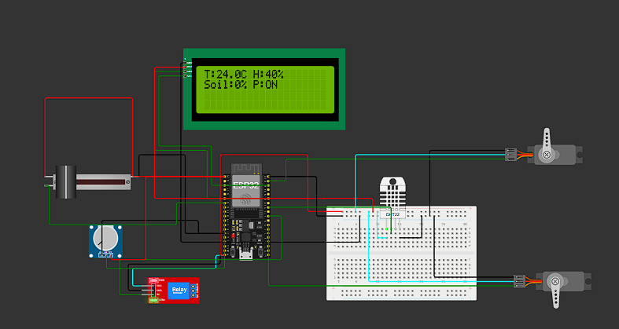
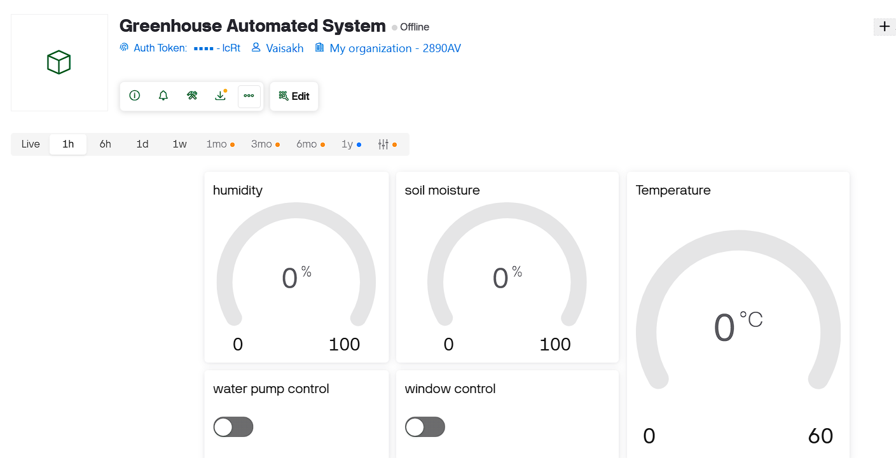

# Greenhouse Automation System with Blynk IoT

An intelligent greenhouse monitoring and control system built on ESP32. Automatically manages ventilation and irrigation based on environmental conditions, with remote manual override via Blynk mobile app.

---

## Features

| Feature | Description |
|---------|-------------|
| **Temperature Monitoring** | Real-time DHT22 sensor readings |
| **Humidity Tracking** | Ambient humidity detection |
| **Soil Moisture Sensing** | Automated irrigation triggers |
| **Smart Ventilation** | Servo-controlled window opens at high temp/humidity |
| **Auto Irrigation** | Water pump activates when soil is dry |
| **Remote Control** | Manual override via Blynk app switches |
| **Local Display** | 16x2 I2C LCD for on-site monitoring |

---

## Hardware Components

| Component | Specification | Purpose |
|-----------|-------------|---------|
| ESP32 DevKit | ESP-WROOM-32 | Main controller + WiFi |
| DHT22 | AM2302 | Temperature & humidity |
| Soil Moisture | Capacitive analog | Soil water content |
| Servo Motors | SG90 x2 | Window + water valve control |
| Relay Module | 5V single channel | Power distribution |
| LCD Display | 16x2 I2C (0x27) | Local status display |

---

## Pin Configuration

| GPIO | Component | Notes |
|------|-----------|-------|
| 19 | DHT22 Data | Temperature/humidity sensor |
| 32 | Soil Moisture | Analog input (0-4095) |
| 5 | Relay Module | Active HIGH |
| 23 | Window Servo | 0°=closed, 180°=open |
| 16 | Water Pump Servo | 0°=closed, 180°=open |

---
## Circuit Diagram




## ⚙️ Automation Logic

### Thresholds (configurable in code)
```cpp
temperatureThreshold = 25.0°C   // Window opens above this
humidityThreshold = 70.0%       // Window opens above this  
minMoistureThreshold = 20.0%    // Pump starts below this
maxMoistureThreshold = 60.0%    // Pump stops above this
```
---
## Behaviour
| Condition                      | Action             | Priority |
| ------------------------------ | ------------------ | -------- |
| Soil < 20%                     | Open water pump    | Auto     |
| Soil > 60%                     | Close water pump   | Auto     |
| Temp > 25°C OR Humidity > 70%  | Open window        | Auto     |
| Temp ≤ 25°C AND Humidity ≤ 70% | Close window       | Auto     |
| Blynk switch toggled           | Override auto mode | Manual   |

---
## Blynk Dashboard Setup
### Datastreams
| Pin | Name           | Type    | Range    | Direction            |
| --- | -------------- | ------- | -------- | -------------------- |
| V0  | Window Control | Integer | 0-1      | Input (App → Device) |
| V1  | Temperature    | Double  | -10-60°C | Output               |
| V2  | Humidity       | Integer | 0-100%   | Output               |
| V3  | Soil Moisture  | Integer | 0-100%   | Output               |
| V4  | Water Pump     | Integer | 0-1      | Input (App → Device) |

### Mobile Widgets
- 3 Gauges → Temperature, Humidity, Soil Moisture
- 2 Switches → Window Control, Water Pump Control



## Simulation

[View on Wokwi](https://wokwi.com/projects/406269260322392065)
